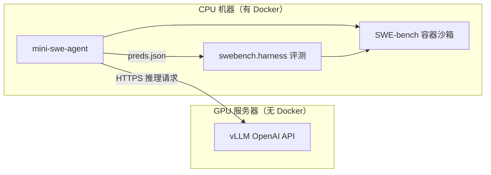

# SWE-bench 评测环境配置与实验总结

> 实验代码库：`RL`  
> Agent 框架：[mini-swe-agent](https://github.com/SWE-agent/mini-swe-agent) v2.3.0  
> 数据集：SWE-bench Verified（`princeton-nlp/SWE-bench_Verified`）

---

## 1. 方案选择与演进

### 1.1 背景与约束

- **GPU 服务器**：可用于部署 vLLM 推理服务，但**无法使用 Docker**（无 root / 无 dockerd），因此不能在本机直接跑 SWE-bench 官方 Docker 沙箱与 harness 评测。
- **目标**：在自有模型（Gemma 系列）上跑 SWE-bench Verified，完成「Agent 解题 → 生成 patch → 官方 harness 评测」全流程。

### 1.2 方案一（初期）：云端沙箱 + 云端评测

| 组件 | 选型 | 作用 |
|------|------|------|
| LLM 推理 | 本地/远程 **vLLM**（OpenAI 兼容 API） | 为 Agent 提供模型 |
| Agent 沙箱 | **Modal** + `swe-rex`（`environment_class: swerex_modal`） | 在云端 CPU 容器里执行 bash、读写代码 |
| Agent 框架 | **mini-swe-agent**（`mini-extra swebench`） | 多轮 tool-call 交互 |
| 模型接入 | **LiteLLM**（`hosted_vllm/<model>`） | 统一 API 调用 |
| 评测 | **sb-cli** 提交云端评测 | 无需本地 Docker |

**对应脚本与配置：**

- 环境安装：`scripts/setup_swebench_cloud.sh`
- 运行 Agent：`scripts/run_swebench_cloud.sh`
- 云端评测：`scripts/eval_swebench_sbcli.sh`
- 配置：`configs/swebench_modal_gemma4_12b.yaml`、`configs/swebench_modal_vllm.yaml`

**放弃原因：** Modal 沙箱按 CPU 运行时间**持续计费**，长时间跑 SWE-bench（每题多轮交互 + 并行 workers）成本较高，不适合大规模批量实验。

### 1.3 方案二（当前）：CPU 机器 Docker + 远程 vLLM

| 组件 | 选型 | 作用 |
|------|------|------|
| LLM 推理 | 远程 **vLLM**（HTTPS 代理，如 Alaya 平台） | GPU 机器只负责推理 |
| Agent 沙箱 | 本地 **Docker**（`environment_class: docker`） | 使用 SWE-bench 官方 eval 镜像 |
| Agent 框架 | mini-swe-agent | 同方案一 |
| 评测 | 本地 **swebench.harness** | Docker 内跑官方测试，无需 sb-cli |

**对应脚本与配置：**

- 环境安装：`scripts/setup_swebench_vm.sh`
- 运行 Agent：`scripts/run_swebench_vm_docker.sh`
- 本地评测：`scripts/eval_swebench_local.sh`
- 配置：`configs/swebench_docker_gemma4_12b.yaml`
- 依赖：`requirements-swebench-docker.txt`（`mini-swe-agent` + `swebench`）

**整体架构：**



**环境变量：** 在 `~/.bashrc` 中设置 `VLLM_BASE` 指向远程 vLLM 地址，Agent 脚本通过 `-c model.model_kwargs.api_base=${VLLM_BASE}` 注入。

---

## 2. 遇到的问题与应对

### 2.1 vLLM 版本与 Gemma-4 模型适配

**问题：** 稳定版 vLLM（0.22.x）无法正确加载 `gemma-4-12B-it`（Unified 架构），报错类似 `[4096] X [8192, 3840] linear mismatch`。

**原因：** Gemma-4 Unified 需要 vLLM nightly（PR #44429）及 `tool-call-parser gemma4`。

**应对：**

- 推理侧改用 **vLLM nightly** 或官方镜像 `vllm/vllm-openai:gemma4-unified`（见 `scripts/serve_gemma4_12b.sh` 内检查逻辑）。
- 实验主力模型切换为 **`gemma-4-26B-A4B-it`**（远程服务已部署，tool calling 可用）。
- 启动 vLLM 时需加：`--enable-auto-tool-choice --tool-call-parser gemma4`。

### 2.2 Context 超限（ContextWindowExceededError）

**问题：** 多轮交互后对话历史不断累积，prompt 可从 ~4k tokens 膨胀到 **70k+ tokens**，触发 context 超限。

**典型表现：** 轨迹中 `exit_status: ContextWindowExceededError`（如 `astropy__astropy-14598`）。

**应对（部分缓解）：**

- 控制 `WORKERS` 并行数，降低单题步数被其他实例拖慢的概率。
- 提高 `step_limit` 的同时需意识到 context 与步数正相关；后续可考虑 summarization、重复观测去重（参考 OpenHands Stuck Detector 思路）。
- 远程 vLLM 设置 `--max-model-len 131072`，保证模型侧上限足够。

### 2.3 Step 超限（LimitsExceeded）

**问题：** Agent 在探索/死循环中耗尽步数，未进入「改代码 → 提交 patch」阶段。

**典型案例：** `astropy__astropy-13453` 在 198 步内 **175 次重复** `sed -n '1720,1740p' astropy/io/ascii/core.py`，`submission` 为空。

**应对：**

- `agent.step_limit`：**200 → 250**（与 mini-swe-agent 内置 `swebench.yaml` 对齐）。
- `temperature`：**0.0 → 0.2**，减轻确定性重复命令的死循环。
- 后续可考虑：重复命令检测、Stuck Detector 类机制。

### 2.4 LLM 请求 Timeout

**问题：** LiteLLM 报错 `Connection timed out after 180.0 seconds`，多发生在 `WORKERS=2` 并行、context 较长时。

**应对：**

- `model.model_kwargs.timeout`：**180 → 600**（秒）。
- 降低并行：`WORKERS=1~2`。
- LiteLLM 默认最多重试 10 次（`MSWEA_MODEL_RETRY_STOP_AFTER_ATTEMPT`）。

### 2.5 Docker 沙箱内环境异常

**问题：** Agent 在容器内跑复现脚本时常遇 `ModuleNotFoundError: numpy`；`pip install` 受 `environment.timeout: 60` 限制而超时。

**影响：** 大量步数耗在配环境而非改代码（如 `astropy__astropy-13236` 轨迹中约一半步数在折腾 numpy）。

**应对方向：** 依赖 SWE-bench 镜像内已有 conda 环境路径；避免在 agent 流程中 pip 装大包；必要时增大 `environment.timeout`（需权衡）。

### 2.6 其他

| 现象 | 说明 |
|------|------|
| HF Hub 404 / 未认证警告 | 加载数据集时的非关键日志，不影响评测 |
| `RuntimeWarning: run_evaluation found in sys.modules` | swebench harness 已知警告，可忽略 |
| Agent `Submitted` ≠ Harness `resolved` | 提交 patch 只表示 agent 端结束；是否修复需 harness 跑官方测试 |

---

## 3. 实验发现

### 3.1 小模型 SWE 能力偏弱

在 Gemma-4-12B 及更小规模模型上，SWE-agent 能力**明显不足**：

- 大量实例 **无法提交 patch**（`LimitsExceeded` / 空 `model_patch`）。
- 易出现 **只读不改**、**重复命令死循环**、**reasoning 输出异常**（Gemma thought channel 残片）等行为。

### 3.2 Gemma-4-26B-A4B-it 仅有部分正确结果

切换到 **26B MoE** 后情况有所改善，但仍远非稳定可用：

**批次 A**（`results/swebench_vm_docker/gemma-4-26B-A4B-it/`，slice 前几题）：

| 指标 | 结果 |
|------|------|
| Agent 提交率 | 3/4 有 patch（1 题步数耗尽） |
| Harness resolved | **1/3**（33.3%） |

| 实例 | Agent | Harness |
|------|-------|---------|
| `astropy__astropy-12907` | Submitted | **resolved** |
| `astropy__astropy-13033` | Submitted | 未 resolved（F2P/P2P 失败） |
| `astropy__astropy-13236` | Submitted | 未 resolved（F2P 失败） |
| `astropy__astropy-13453` | LimitsExceeded | 无 patch |

**批次 B**（`gemma-4-26B-A4B-it-10:30/`，slice 10:30，共 20 题）：

| 阶段 | 指标 | 结果 |
|------|------|------|
| Agent | 提交 patch | **9/20**（45%） |
| Harness | 评测题数 | **9**（11 题空 patch 跳过） |
| Harness | **resolved** | **6/9**（66.7%，Submitted 内通过率） |
| 端到端 | **resolved / 总题数** | **6/20**（**30%**） |

评测命令：`eval_swebench_local.sh .../preds.json vm-docker-run`（2026-06-09，耗时 4m22s）。

**Agent 退出状态（20 题）：**

| 状态 | 数量 |
|------|------|
| Submitted | 9 |
| LimitsExceeded | 3 |
| ContextWindowExceededError | 4 |
| Timeout | 2 |
| TimeoutExpired | 2 |

**Harness resolved（6）：**  
`7336`, `7671`, `14539`, `14995`, `django-10880`, `django-10914`

**Harness 未 resolved（3）：**  
`14508`, `7606`, `django-10999`

详细记录见：`results/swebench_vm_docker/gemma-4-26B-A4B-it-10:30/eval_summary.yaml`

### 3.3 Qwen3.6-27B（同 slice 10:30，共 20 题）

| 阶段 | 指标 | Qwen3.6-27B | Gemma-4-26B-A4B-it（对照） |
|------|------|-------------|---------------------------|
| Agent | 提交 patch | **17/20**（85%） | 9/20（45%） |
| Harness | 评测题数 | **17** | 9 |
| Harness | **resolved** | **10/17**（58.8%） | 6/9（66.7%） |
| 端到端 | **resolved / 总题数** | **10/20**（**50%**） | 6/20（30%） |

评测命令：`eval_swebench_local.sh .../Qwen3.6-27B-10:30/preds.json vm-docker-run`（2026-06-10，耗时 8m25s）。

**Agent 退出状态（20 题）：** Submitted 17，Timeout 2，TimeoutExpired 1

**Harness resolved（10）：**  
`14365`, `14508`, `14539`, `14995`, `7336`, `7671`, `django-10880`, `django-10914`, `django-10973`, `django-11066`

**Harness 未 resolved（7）：**  
`7166`, `7606`, `8872`, `8707`, `django-10999`, `django-11087`, `django-10554`

详细记录见：`results/swebench_vm_docker/Qwen3.6-27B-10:30/eval_summary.yaml`

**结论：**

1. **Submitted 率 ≠ 正确率**：Gemma 批次 B 为 9 提交 / 6 resolved；Qwen 为 17 提交 / 10 resolved。
2. **同 slice 10:30 端到端**：Qwen3.6-27B **50%**（10/20）优于 Gemma-4-26B-A4B-it **30%**（6/20），主要差距在 Agent 提交率（85% vs 45%）。
3. Agent 仍可能 **幻觉式自报验证通过**（轨迹里测试 FAIL 仍提交）。
4. 距离稳定可用的 SWE-agent **仍有提升空间**；失败模式：timeout、patch 逻辑错误、引入回归等。

---

## 4. 代码库配置要点（可复现清单）

### 4.1 目录与脚本一览

```
RL/
├── configs/
│   ├── swebench_docker_gemma4_12b.yaml   # 当前主力：Docker + 远程 vLLM
│   ├── swebench_modal_gemma4_12b.yaml    # 备选：Modal 沙箱
│   └── swebench_modal_vllm.yaml          # 备选：Modal + 通用 vLLM
├── scripts/
│   ├── setup_swebench_vm.sh              # CPU 机 conda 环境
│   ├── setup_swebench_cloud.sh           # Modal + sb-cli 环境
│   ├── run_swebench_vm_docker.sh         # 【主力】Agent 运行
│   ├── run_swebench_cloud.sh             # Modal Agent 运行
│   ├── eval_swebench_local.sh            # 【主力】本地 harness 评测
│   ├── eval_swebench_sbcli.sh            # 云端 sb-cli 评测
│   └── serve_gemma4_12b.sh               # GPU 机 vLLM 启动（含版本检查）
├── requirements-swebench-docker.txt
└── requirements-swebench.txt
```

### 4.2 当前推荐配置（`configs/swebench_docker_gemma4_12b.yaml`）

| 参数 | 当前值 | 说明 |
|------|--------|------|
| `model_name` | `hosted_vllm/gemma-4-26B-A4B-it` | LiteLLM 模型名 |
| `api_base` | 远程 vLLM `/v1` | 可由 `VLLM_BASE` 覆盖 |
| `temperature` | `0.2` | 降低死循环 |
| `timeout` | `600` | LLM 请求超时（秒） |
| `agent.step_limit` | `250` | 最大交互步数 |
| `environment.timeout` | `60` | 单条 bash 超时（秒） |
| `container_timeout` | `4h` | Docker 容器存活时间 |

### 4.3 运行命令速查

**Agent（CPU 机器）：**

```bash
# ~/.bashrc 中 export VLLM_BASE=https://.../v1
bash scripts/run_swebench_vm_docker.sh
# 常用 override：
# SLICE=0:5 WORKERS=2 MODEL=hosted_vllm/gemma-4-26B-A4B-it
```

**本地评测：**

```bash
MAX_WORKERS=3 bash scripts/eval_swebench_local.sh \
  results/swebench_vm_docker/gemma-4-26B-A4B-it/preds.json \
  gemma-4-26B-A4B-it-eval
```

**结果路径：**

| 产物 | 路径 |
|------|------|
| 预测 patch | `results/swebench_vm_docker/<model>/preds.json` |
| Agent 轨迹 | `results/.../<instance_id>/*.traj.json` |
| Harness 报告 | `logs/run_evaluation/<run_id>/` |
| 评测日志 | `results/swebench_local_reports/<run_id>.log` |

### 4.4 输出目录约定

`run_swebench_vm_docker.sh` 默认按 **模型名 + slice** 分子目录，例如：

`results/swebench_vm_docker/gemma-4-26B-A4B-it-10:30/`

避免不同实验互相覆盖。

---

## 5. 后续改进方向

1. **Agent 鲁棒性**：重复命令检测、context 压缩、阶段式 prompt（探索 → 修改 → 提交）。
2. **模型与推理**：继续评估更大/更强模型；优化 vLLM 并发与 timeout 配置。
3. **环境效率**：减少 agent 在容器内 pip/配环境上的无效步数。
4. **评测流水线**：Agent 与 harness 分离，preds.json 批量本地评测，便于 RL 训练采集 reward。
5. **成本**：GPU 只跑 vLLM，CPU 机跑 Docker，相比 Modal 持续计费更可控。

---

## 6. 一句话总结

从 **「Modal 云端沙箱 + sb-cli 云端评测」** 演进到 **「CPU Docker 沙箱 + 远程 vLLM + 本地 harness」**，解决了 Docker 不可用与 Modal 持续计费问题；通过调参缓解了 context/step/timeout 问题，但 **Gemma-4-26B-A4B-it 在 SWE-bench Verified 上仅少量 resolved**，小模型几乎无法完成有效 patch，整体 agent 能力仍有较大提升空间。
