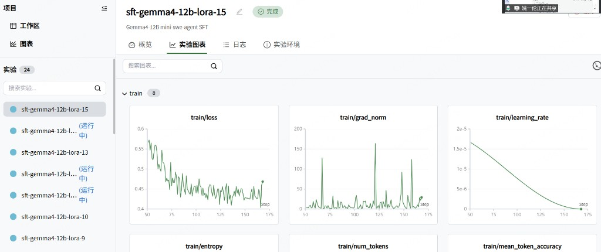

# 周报：Gemma4-12B SWE SFT & RL

**周期：** 2026.06.09 – 2026.06.15  
**目标：** 搭建 Gemma4-12B + mini-swe-agent + SWE-Gym 的 **SFT 冷启动 → 真在线 RL** 流水线

---

## 一、本周核心成果

1. **完成 SFT LoRA 训练**，产出 `checkpoint-150`，作为 RL 初始策略
2. **落地 SkyRL GRPO 真在线 RL**，替代 legacy 伪 RL（采样后手动重启 vLLM）
3. **打通跨机训练架构**：GPU（训练/推理）+ CPU（Docker rollout）+ SSH 隧道 + Ray 集群

---

## 二、SFT 方案

### 2.1 任务定义

在 **mini-swe-agent 轨迹** 上做监督微调，让 Gemma4-12B 学会 SWE 场景下的多轮工具调用与 patch 生成格式，为后续 RL 提供可采样、可优化的初始策略。

### 2.2 微调数据

#### 数据来源

SFT 使用 **mini-swe-agent 专家轨迹**（非 SWE-Gym 原始 issue 文本），通过 HuggingFace 拉取后经清洗、采样、去泄漏，合并为最终训练集。

| 数据集 | HuggingFace ID | 采样上限 | 说明 |
|--------|----------------|----------|------|
| **主集** | `Kwai-Klear/SWE-smith-mini_swe_agent_plus-trajectories-66k` | 5000 条 | mini-swe-agent / mini-swe-agent-plus 成功轨迹 |
| **补充集** | `JetBrains-Research/agent-trajectories-swesmith-random-subset` | 1500 条 | JetBrains SWE-smith 随机子集，增加仓库多样性 |
| **本地（可选）** | `MINISWE_TRAJ` 目录 / jsonl | — | 有自采轨迹时替代 HF 主集 |

数据准备命令：`bash scripts/run_prepare_data.sh`（内部调用 `data/prepare_miniswe_sft.py` → `data/merge_sft_datasets.py`）

#### 数据流水线

```
HF 轨迹 raw
  → 按 repo 分层采样（stratified_sample，seed=42）
  → 格式/质量过滤
  → 去除 SWE-bench Verified 泄漏（filter_leakage）
  → data/sft/miniswe_train.jsonl
  → 合并 shuffle
  → data/sft/sft_merged.jsonl   ← SFT 实际训练文件
```

#### 过滤规则

| 规则 | 说明 |
|------|------|
| **resolved_only** | 仅保留 resolved / submitted 成功轨迹 |
| **mini-swe 格式** | assistant 含 `THOUGHT:`，user 含 `<returncode>` 等 agent 观测标记 |
| **长度上限** | 单条轨迹字符数 ≤ 120k（`--max_chars`），过长丢弃 |
| **泄漏过滤** | 剔除 `instance_id` 落在 **SWE-bench Verified test** 中的样本，避免评测集污染 |
| **必填字段** | 需有 `instance_id` 与完整 `messages` 多轮对话 |

#### 单条样本格式

每条 jsonl 经 `trajectory_to_sft_row` 转为 Gemma4 chat 格式：

```json
{
  "instance_id": "django__django-12345",
  "messages": [
    {"role": "system", "content": "..."},
    {"role": "user", "content": "issue + 首轮观测"},
    {"role": "assistant", "content": "THOUGHT: ...\nACTION: ..."},
    {"role": "user", "content": "<returncode>0</returncode>..."},
    ...
  ],
  "source": "miniswe_kwai | miniswe_jetbrains",
  "metadata": {"resolved": true, "n_turns": 12, "exit_status": "Submitted"}
}
```

- 消息经 `agent_messages_to_gemma` + `attach_tool_call_ids` 适配 **Gemma4 `apply_chat_template`**
- 训练时 tokenize 后做 **多轮因果 LM**（`chunked_nll`，长上下文分块算 loss，避免 32k 词表 logits OOM）

#### 辅助数据文件

| 路径 | 说明 |
|------|------|
| `data/sft/sft_merged.jsonl` | **SFT 训练入口**（当前流水线仅合并 mini-swe 源） |
| `data/sft/miniswe_train.jsonl` | 清洗后的 mini-swe 中间集 |
| `data/sft/miniswe_stats.json` | 采样/过滤/source 分布统计 |
| `data/sft/seq_length_stats.json` | token 长度分析 → 推荐 `max_seq_length` |
| `data/sft/preprocessed/` | tokenize 磁盘缓存，加速重复训练 |
| `data/splits/verified_dev_100.json` | Verified 留出 100 条 dev（与训练泄漏过滤配套） |

> **与 RL 数据的区别：** SFT 用 **专家轨迹 messages** 做模仿学习；RL 用 **SWE-Gym instance**（`train_lite.parquet` / `train.parquet`）做在线交互，reward 来自 Docker 内真实 `eval_script`。

### 2.3 训练配置

**两阶段策略：**

| 阶段 | 命令 | 关键超参 | 用途 |
|------|------|----------|------|
| **LoRA** | `STAGE=lora bash scripts/run_sft.sh` | r=64, α=128, lr=2e-5, 2 epoch | 快速迭代、产出 adapter |
| **Full** | `STAGE=full bash scripts/run_sft.sh` | 全参, lr=1e-5, 1 epoch | 可选，更强基座 |

**工程配置：**

- **基座：** `models/gemma-4-12B-it`
- **并行：** 8×H100 + DeepSpeed ZeRO-3（`configs/accelerate_deepspeed_zero3_8gpu.yaml`）
- **Batch：** per_device=1，gradient_accumulation=8（有效 batch=8）
- **上下文：** `max_seq_length` 最高 28672（适配长 issue + 多轮对话）
- **Loss：** `chunked_nll`（长序列分块 NLL）
- **监控：** SwanLab（project: `swe-rl`）

### 2.4 训练曲线

实验 **`sft-gemma4-12b-lora`**（Gemma4-12B mini-swe-agent SFT，LoRA r=64）SwanLab 记录：



| 指标 | 观察 |
|------|------|
| **train/loss** | 约 175 step，从 ~0.57 降至 ~0.44，收敛正常 |
| **train/learning_rate** | 线性衰减，初值 2e-5 |
| **train/grad_norm** | 整体平稳，偶发尖峰（长序列 batch 常见） |

### 2.5 产出

```
outputs/sft-gemma4-12b-miniswe-lora/checkpoint-150/
├── adapter_config.json
├── adapter_model.safetensors
└── ...
```

该 checkpoint 作为 RL 阶段的 **LoRA 初始权重**，通过 `trainer.policy.model.lora.adapter_path` 加载。

---

## 三、RL 方案（SkyRL GRPO）

### 3.1 与 Legacy 伪 RL 的区别

| | Legacy 伪 RL | SkyRL 真在线 RL |
|--|-------------|----------------|
| 策略更新 | 离线轨迹 → 再 SFT | 在线 GRPO 梯度更新 |
| 推理 | 外部 vLLM，手动重启 | SkyRL 内置 vLLM，**NCCL 自动同步权重** |
| 环境 | 无真实 Docker 交互 | CPU 上 mini-swe-agent **真实 Docker 沙箱** |
| Reward | 启发式 / 离线标注 | patch 应用后跑 **eval_script**，resolved=1/0 |

### 3.2 整体架构

```
┌─────────────────────────────────────────────────────────────┐
│  GPU 机（8×H100）                                            │
│  ┌──────────────┐  ┌──────────────┐  ┌──────────────────┐  │
│  │ FSDP Policy  │  │ FSDP Ref     │  │ vLLM ×2 (TP=1)   │  │
│  │   6 GPU      │  │   6 GPU      │  │   2 GPU          │  │
│  │  GRPO 更新   │  │  KL 参考     │  │  rollout 采样    │  │
│  └──────┬───────┘  └──────────────┘  └────────┬─────────┘  │
│         │         NCCL weight sync ◄───────────┘            │
│         │  Ray Head (127.0.0.1:6379)                        │
└─────────┼───────────────────────────────────────────────────┘
          │ SSH 隧道
┌─────────┼───────────────────────────────────────────────────┐
│  CPU 机（agent008v + Docker）                                │
│  ┌──────▼──────────────────────────────────────────────────┐ │
│  │ Ray Worker（docker_node=1）                              │ │
│  │  init_and_run → mini-swe-agent → docker run SWE 镜像     │ │
│  │  HTTP 调 GPU vLLM（:8001）生成 action                    │ │
│  │  reward = eval_script 通过 → 1，否则 0                   │ │
│  └─────────────────────────────────────────────────────────┘ │
└─────────────────────────────────────────────────────────────┘
```

### 3.3 算法与超参

| 类别 | 配置 |
|------|------|
| 算法 | **GRPO**（Group Relative Policy Optimization） |
| KL 约束 | `use_kl_loss=true`, `kl_loss_coef=0.005` |
| 策略 LR | `5e-7` |
| Batch | `train_batch_size=8`, `n_samples_per_prompt=4`（每 prompt 4 条轨迹） |
| 上下文 | `max_input_length=28672`, `max_generate_length=4096`, `max_turns=20` |
| LoRA | rank=64（从 SFT adapter 加载），同步路径 `/tmp/skyrl_lora_sync` |
| 训练策略 | FSDP，`colocate_all=false`（训练与推理 GPU 分离） |

### 3.4 Rollout 流程（单条轨迹）

1. 从 parquet 读取 SWE-Gym instance（`problem_statement` + `eval_script`）
2. Ray 将 `init_and_run` 调度到 **CPU worker**（`docker_node` 资源）
3. mini-swe-agent 在 Docker 容器中多轮交互：
   - 模型 action → `docker exec` 执行 bash
   - 观测返回 agent → 再调 **GPU vLLM HTTP** 生成下一步
4. Agent 提交 patch → `git apply` → 跑 `eval_script`
5. **Reward：** resolved（returncode=0）→ 1，否则 0
6. 轨迹 tokenize 后送回 GPU，参与 GRPO advantage 计算与策略更新
7. **NCCL** 将更新后 LoRA 权重推送到 vLLM，进入下一步

### 3.5 数据

| 文件 | 用途 |
|------|------|
| `data/rl/skyrl_parquet/train_lite.parquet` | **rl1**：SWE-Gym-Lite 子集，5 epoch |
| `data/rl/skyrl_parquet/train.parquet` | **rl2**：全量 SWE-Gym，20 epoch |
| `data/rl/skyrl_parquet/validation.parquet` | 验证集（50 条 cap） |

预处理：`integrations/skyrl_miniswe/preprocess_swegym.py`（过滤 SWE-bench Verified 泄漏）

### 3.6 代码集成（`integrations/skyrl_miniswe/`）

| 模块 | 职责 |
|------|------|
| `main.py` | SkyRL `BasePPOExp` 入口 |
| `generator.py` | `MiniSweAgentGenerator`，实现 `generate()` 接口 |
| `rollout_worker.py` | Ray remote `init_and_run`，最小 import 避免 pickle 失败 |
| `mini_swe_utils.py` | Docker 环境创建、patch 评测、轨迹保存 |
| `swebench.yaml` | mini-swe-agent prompt 模板与 Docker 配置 |

### 3.7 启动流程

```bash
# GPU：Ray head
bash scripts/run_skyrl_ray_head.sh

# CPU：加入集群（需 Docker + swebench 环境）
CONDA_ENV=swebench RAY_ADDRESS=127.0.0.1:6379 bash scripts/run_skyrl_ray_worker.sh

# GPU：GRPO 训练
SFT_CHECKPOINT=outputs/sft-gemma4-12b-miniswe-lora/checkpoint-150 \
SKYRL_HTTP_HOST=127.0.0.1 \
STAGE=rl1 \
bash scripts/run_rl_skyrl.sh
```

---

## 四、关键工程问题与修复

本周联调中解决的主要阻塞：

| 问题 | 根因 | 修复 |
|------|------|------|
| vLLM health 600s 超时 | `executor=ray` 时 EngineCore 二次 `ray.init()`，隧道下 GCS 不可达 | TP=1 默认改 `distributed_executor_backend=mp` |
| vLLM 权重更新冲突 | vLLM 0.22.1 已内置 update 接口，与自定义 wrap 重复 | 精简 `NewInferenceWorkerWrap` |
| LoRA 同步报错 | PEFT `asdict()` 后 `task_type` 变字符串 | `fsdp_worker` / `fsdp_strategy` 兼容 |
| Rollout pickle 失败 | 重模块与 `@ray.remote` 同文件 | 拆出 `rollout_worker.py` |
| `docker not found` | rollout 落到 GPU head；worker PATH 无 docker | 默认 `docker_node` 调度 + `/usr/bin/docker` 绝对路径 |
| Ray 地址错乱 | SSH 隧道下 GCS 广播容器内网 IP | `patch_ray_tunnel.py` + `RAY_PRESERVE_LOCALHOST_IP=1` |
| `docker_node` pending | CPU worker 未注册资源或僵尸节点 | 规范 `ray stop` 后仅 1 head + 1 worker 重启 |

---

## 五、当前进展

| 项 | 状态 |
|----|------|
| SFT LoRA checkpoint-150 | ✅ 完成 |
| SkyRL 训练启动（模型/vLLM/权重同步） | ✅ 可进入 `generate` 阶段 |
| CPU Docker rollout 稳定调度 | 🔄 联调中（需 `docker_node` 资源就绪） |
| rl1 完整 step（rollout → update） | ⏳ 待跑通 |
| rl2 全量训练 / SWE-bench 评测 | ⏳ 后续 |

---

## 六、下周计划

1. **稳定 Ray 双机集群**：`ray status` 恒为 2 nodes + `docker_node: 1.0`
2. **跑通 rl1**：5 epoch lite 数据端到端 GRPO
3. **启动 rl2**：全量 SWE-Gym 20 epoch
4. **评测闭环**：导出 checkpoint → SWE-bench 评测 → Verifier 阶段
