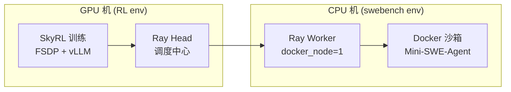

## Ray 是什么？

**Ray** 是一个 Python **分布式计算框架**，用来把任务调度到多台机器上跑。

在你们 SWE-RL 流程里，Ray 的作用是：



- **GPU 机**：跑 Ray **Head**（集群「大脑」）+ 模型训练
- **CPU 机**：跑 Ray **Worker**，接收 rollout 任务，在 Docker 里执行 Agent 交互

没有 Ray，训练只能在单机跑；有了 Ray，可以把 **Docker 沙箱** 放到 CPU 上，GPU 专心做梯度更新和推理。

---

## 你需要装 Ray 吗？

| 场景 | 是否需要 |
|------|----------|
| 只做 SWE-bench Agent + harness 评测 | **不需要** |
| 做 SkyRL RL 训练（Phase 3） | **需要**（CPU 装 worker，GPU 装 head + 训练） |

你目前 CPU 上跑评测，**暂时不用装 Ray**。

---

## 如何安装

### CPU 机（`swebench` 环境，仅 Ray Worker）

```bash
conda activate swebench
pip install "ray[default]>=2.51.1"
```

验证：

```bash
python -c "import ray; print(ray.__version__)"
ray --version
```

### GPU 机（`RL` 环境，完整训练栈）

Ray 会随 SkyRL 一起装：

```bash
conda activate RL
cd ~/RL
bash scripts/setup_skyrl.sh
```

或手动：

```bash
pip install -r requirements-skyrl-rl.txt   # 含 ray[default]>=2.51.1
```

---

## 安装后怎么用（RL 阶段）

**GPU 上先起 Head：**

```bash
conda activate RL
bash scripts/run_skyrl_ray_head.sh
# 会打印类似：Ray head at 10.x.x.x:6379
```

**CPU 上加入集群：**

```bash
conda activate swebench
export RAY_RUNTIME_ENV_HOOK=ray._private.runtime_env.uv_runtime_env_hook.hook

RAY_ADDRESS=<GPU内网IP>:6379 \
CONDA_ENV=swebench \
bash scripts/run_skyrl_ray_worker.sh
```

**GPU 上启动训练：**

```bash
SKYRL_HTTP_HOST=<GPU内网IP> \
SKYRL_REQUIRE_DOCKER_NODE=1 \
STAGE=rl1 \
bash scripts/run_rl_skyrl.sh
```

---

## 注意点

1. **网络**：CPU 要能访问 GPU 的 **6379** 端口（Ray 通信）
2. **版本**：CPU 和 GPU 上的 Ray 版本尽量一致（都用 `>=2.51.1`）
3. **CPU 只需 `ray` + 已有 `mini-swe-agent`**，不必装 SkyRL / vLLM / torch
4. **评测阶段**（`run_swebench_vm_docker.sh`）完全不依赖 Ray

---

**一句话**：Ray 是分布式任务调度器；评测不用装，RL 训练时 GPU 跑 head、CPU 跑 worker，CPU 上 `pip install "ray[default]>=2.51.1"` 即可。